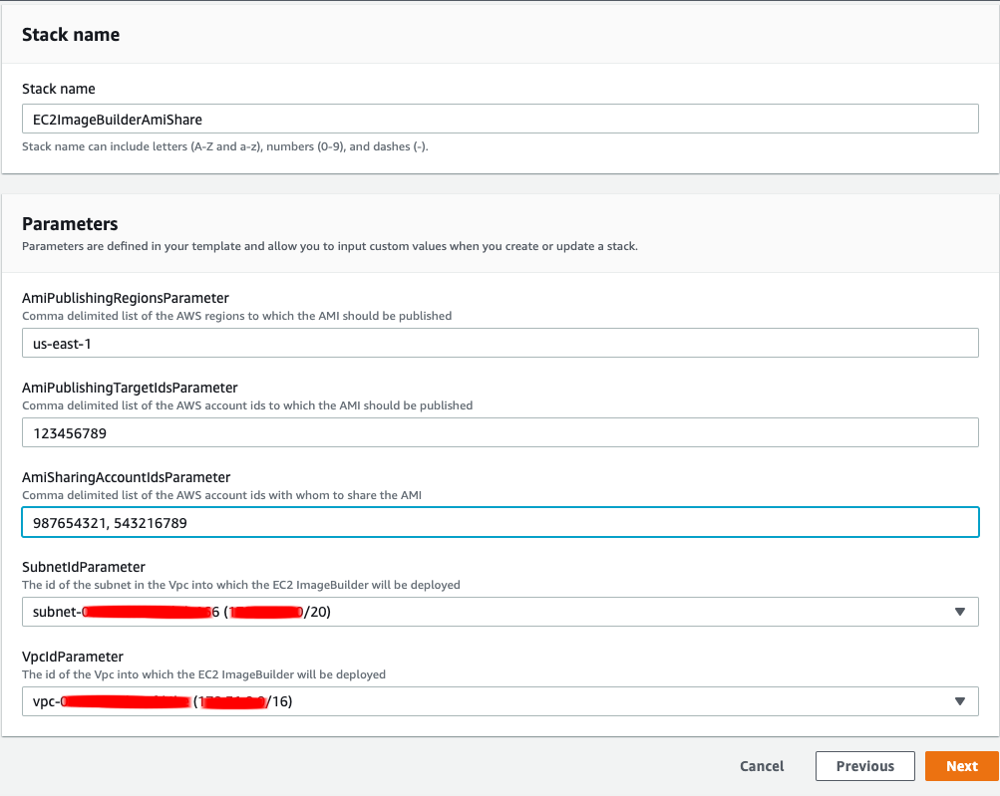
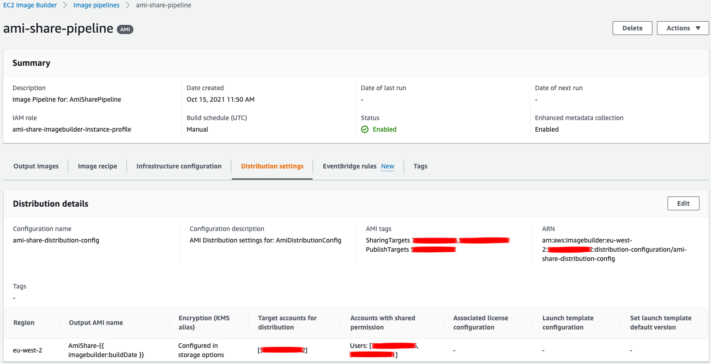
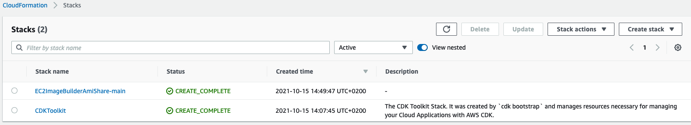
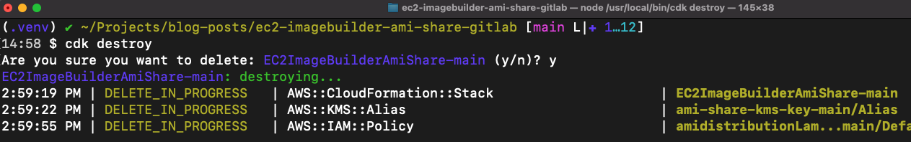

# ec2-imagebuilder-ami-share

CloudFormation template and CDK stack that contains a CustomResource with Lambda function to allow the setting of the `targetAccountIds` attribute of the EC2 Image Builder AMI distribution settings which is not currently supported in CloudFormation or CDK.

---

[EC2 Image Builder](https://aws.amazon.com/image-builder/) simplifies the building, testing, and deployment of Virtual Machine and container images for use on AWS or on-premises. Customers looking to create custom AMIs ([Amazon Machine Image](https://docs.aws.amazon.com/AWSEC2/latest/UserGuide/AMIs.html)) or container images can leverage EC2 Image Builder to significantly reduce the effort of keeping images up-to-date and secure through its simple graphical interface, built-in automation, and AWS-provided security settings. 

EC2 Image Builder includes [distribution settings](https://docs.aws.amazon.com/imagebuilder/latest/userguide/manage-distribution-settings.html) that allow for the *publishing* and *sharing* of AMIs. *Publishing* an AMI allows customers to define the AWS accounts and regions to which the generated AMI will be copied. *Sharing* an AMI allows customers to define the AWS accounts and regions to which the generated AMI will be shared. AWS accounts that have been nominated as targets for AMI sharing are able to launch EC2 instances based on those AMIs.

The AWS CLI fully supports [creating and updating distribution settings for AMIs](https://docs.aws.amazon.com/imagebuilder/latest/userguide/crud-ami-distribution-settings.html).

AWS CloudFormation offers the capability of defining [distribution settings for EC2 Image Builder](https://docs.aws.amazon.com/AWSCloudFormation/latest/UserGuide/aws-properties-imagebuilder-distributionconfiguration-distribution.html). However, at the time of writing this blog post, AWS CloudFormation does not provide the capability of defining the target accounts to which a generated AMI will be published. Specifically, the `targetAccountIds` attribute is not currently exposed through AWS CloudFormation.

This project describes how a [CloudFormation Custom Resource](https://docs.aws.amazon.com/AWSCloudFormation/latest/UserGuide/template-custom-resources.html) can be leveraged to allow customers to access the full set of distribution settings for EC2 Image Builder, including the `targetAccountIds` attribute, as part of their CloudFormation templates or CDK ([Cloud Development Kit](https://aws.amazon.com/cdk/)) code base.

The project assumes the availability of at least 3 AWS accounts:

1. A *tooling* account where the CloudFormation template is deployed and the project resources are created.
2. A *publishing* account (or accounts) to which the generated AMI would be published.
3. A *sharing* account (or accounts) to whom the generated AMI would be shared.

The code will only deploy resources into the *tooling* account. The existence of the *publishing* and *sharing* accounts are required in order to set the respective EC2 Image Builder distribution configuration settings.

----

* [Solution architecture](#solution-architecture)
* [Deploying the CloudFormation project](#deploying-the-cloudformation-project)
* [Clean up the CloudFormation project](#clean-up-the-cloudformation-project)
* [Deploying the CDK project](#deploying-the-cdk-project)
* [Clean up the CDK project](#clean-up-the-cdk-project)
* [Executing unit tests](#executing-unit-tests)
* [Security](#security)
* [License](#license)

# Solution architecture

The solution architecture discussed in this post is presented below:


1. A CloudFormation template, generated manually or via CDK, is deployed to the AWS CloudFormation service.
2. The provided CloudFormation template includes the definition of a custom resource. The custom resource is implement via a Lambda function which will use the [Python Boto3 library](https://boto3.amazonaws.com/v1/documentation/api/latest/reference/services/imagebuilder.html#imagebuilder.Client.update_distribution_configuration) to update the AMI distribution configuration of EC2 Image Builder, including setting the `targetAccountIds` attribute. The `targetAccountIds` attribute is currently not available to CloudFormation but it can be set with the Boto3 library.
3. The CloudFormation service will call the Lambda function defined in the custom resource, waiting for the result of the Lambda invocation.
4. Upon successful completion of the Lambda function, CloudFormation will resume the creation of the remaining resources of the stack.

# Deploying the CloudFormation project

The relevant section of the [EC2ImageBuilderAmiShare.yaml](cloudformation/EC2ImageBuilderAmiShare.yaml) CloudFormation template, in which the Custom Resource and Lambda function are defined, is shown below:

```
 AmiDistributionLambda:
    Type: 'AWS::Lambda::Function'
    Properties:
      Code:
        ZipFile: |
          ##################################################
          ## EC2 ImageBuilder AMI distribution setting targetAccountIds
          ## is not supported by CloudFormation (as of September 2021).
          ## https://docs.aws.amazon.com/AWSCloudFormation/latest/UserGuide/aws-resource-imagebuilder-distributionconfiguration.html
          ##
          ## This lambda function uses Boto3 for EC2 ImageBuilder in order 
          ## to set the AMI distribution settings which are currently missing from 
          ## CloudFormation - specifically the 'targetAccountIds' attribute
          ## https://boto3.amazonaws.com/v1/documentation/api/latest/reference/services/imagebuilder.html
          ##################################################

          import os
          import boto3
          import botocore
          import json
          import logging
          import cfnresponse

          def get_ssm_parameter(ssm_param_name: str, aws_ssm_region: str):
              ssm = boto3.client('ssm', region_name=aws_ssm_region)
              parameter = ssm.get_parameter(Name=ssm_param_name, WithDecryption=False)
              return parameter['Parameter']

          def get_distributions_configurations(
                  aws_distribution_regions, 
                  ami_distribution_name,
                  publishing_account_ids, 
                  sharing_account_ids
              ):

              distribution_configs = []

              for aws_region in aws_distribution_regions:
                  distribution_config = {
                      'region': aws_region,
                      'amiDistributionConfiguration': {
                          'name': ami_distribution_name,
                          'description': f'AMI Distribution configuration for {ami_distribution_name}',
                          'targetAccountIds': publishing_account_ids,
                          'amiTags': {
                              'PublishTargets': ",".join(publishing_account_ids),
                              'SharingTargets': ",".join(sharing_account_ids)
                          },
                          'launchPermission': {
                              'userIds': sharing_account_ids
                          }
                      }
                  }

                  distribution_configs.append(distribution_config)

              return distribution_configs

          def handler(event, context):
              # set logging
              logger = logging.getLogger()
              logger.setLevel(logging.DEBUG)
              
              # print the event details
              logger.debug(json.dumps(event, indent=2))

              props = event['ResourceProperties']
              aws_region = os.environ['AWS_REGION']
              aws_distribution_regions = props['AwsDistributionRegions']
              imagebuiler_name = props['ImageBuilderName']
              ami_distribution_name = props['AmiDistributionName']
              ami_distribution_arn = props['AmiDistributionArn']
              ssm_publishing_account_ids_param_name = props['PublishingAccountIds']
              ssm_sharing_account_ids_param_name = props['SharingAccountIds']

              publishing_account_ids = get_ssm_parameter(ssm_publishing_account_ids_param_name, aws_region)['Value'].split(",")
              sharing_account_ids = get_ssm_parameter(ssm_sharing_account_ids_param_name, aws_region)['Value'].split(",")

              logger.info(publishing_account_ids)
              logger.info(sharing_account_ids)

              if event['RequestType'] != 'Delete':
                  try:
                      client = boto3.client('imagebuilder')
                      response = client.update_distribution_configuration(
                          distributionConfigurationArn=ami_distribution_arn,
                          description=f"AMI Distribution settings for: {imagebuiler_name}",
                          distributions=get_distributions_configurations(
                              aws_distribution_regions=aws_distribution_regions,
                              ami_distribution_name=ami_distribution_name,
                              publishing_account_ids=publishing_account_ids,
                              sharing_account_ids=sharing_account_ids
                          )
                      )
                      cfnresponse.send(event, context, cfnresponse.SUCCESS, {})
                  except botocore.exceptions.ClientError as err:
                      logger.critical(err)
                      cfnresponse.send(event, context, cfnresponse.FAILED, {})
              
              # nothing to do on delete so send a success response
              cfnresponse.send(event, context, cfnresponse.SUCCESS, {})
      Role:
        'Fn::GetAtt':
          - AmiDistributionLambdaRole
          - Arn
      Handler: index.handler
      Runtime: python3.6
      Timeout: 30
    DependsOn:
      - AmiDistributionLambdaRoleDefaultPolicy
      - AmiDistributionLambdaRole
  AmiPublishingTargetIds:
    Type: 'AWS::SSM::Parameter'
    Properties:
      Type: StringList
      Value:
        Ref: AmiPublishingTargetIdsParameter
      Name: /master-AmiSharing/AmiPublishingTargetIds
  AmiSharingAccountIds:
    Type: 'AWS::SSM::Parameter'
    Properties:
      Type: StringList
      Value: 
        Ref: AmiSharingAccountIdsParameter
      Name: /master-AmiSharing/AmiSharingAccountIds
  AmiDistributionCustomResource:
    Type: 'AWS::CloudFormation::CustomResource'
    Properties:
      ServiceToken:
        'Fn::GetAtt':
          - AmiDistributionLambda
          - Arn
      AwsDistributionRegions: 
        Ref: AmiPublishingRegionsParameter
      ImageBuilderName: AmiDistributionConfig
      AmiDistributionName: 'AmiShare-{{ imagebuilder:buildDate }}'
      AmiDistributionArn:
        'Fn::GetAtt':
          - AmiShareDistributionConfig
          - Arn
      PublishingAccountIds:
        Ref: AmiPublishingTargetIds
      SharingAccountIds:
        Ref: AmiSharingAccountIds
    DependsOn:
      - AmiShareDistributionConfig
    UpdateReplacePolicy: Delete
    DeletionPolicy: Delete
```

Follow the steps below to deploy the CloudFormation template.

1. Download the [EC2ImageBuilderAmiShare.yaml](cloudformation/EC2ImageBuilderAmiShare.yaml) template file to your local machine.
2. Log into the AWS Console → navigate to the CloudFormation console.
3. Click on the *Create stack* button and choose *With new resources (standard)*.
4. In the *Create stack* screen, select the option to *Upload a template file*.
5. Choose the [EC2ImageBuilderAmiShare.yaml](cloudformation/EC2ImageBuilderAmiShare.yaml) template file.
6. Click *Next*.
7. In the *Specify stack details* screen, provide the following values:
    1. Stack name: **EC2ImageBuilderAmiShare**
    2. AmiPublishingRegionsParameter: *&lt;AWS region to which the AMI should be published, e.g. us-east-1&gt;*
    3. AmiPublishingTargetIdsParameter: *&lt;AWS account ids to which the AMI should be published&gt;*
    4. AmiSharingAccountIdsParameter: *&lt;AWS account ids to whom the AMI should be shared&gt;*
    5. SubnetIdParameter: *&lt;Select a desired subnet&gt;*
    6. VpcIdParameter: *&lt;Select a desired VPC&gt;*



8. Click *Next*.
9. On the *Configure stack options* screen, click *Next* to accept defaults.
10. On the *Review EC2ImageBuilderAmiShare* screen, click the check box for **I acknowledge that AWS CloudFormation might create IAM resources with custom names.**
11. Click *Create stack*.
12. Confirm that the stack reaches the **CREATE_COMPLETE** state.

Verify the distribution settings of EC2 Image Builder.

1. Log into the AWS Console → navigate to the EC2 Image Builder console.
2. Click on the pipeline with name `ami-share-pipeline` to open the detailed pipeline view.
3. Click on the *Distribution settings* and review the *Distribution details*.
4. Confirm that the following values match the parameter values passed to the CloudFormation template:
    1. Region
    2. Target accounts for distribution
    3. Accounts with shared permissions



The CloudFormation template has successfully deployed the EC2 Image Builder and the *Target accounts for distribution* value has been correctly set through the use of a CustomResource Lambda function.

At this point the pipeline could be *Run* in order to generate, distribute and share the AMI.

Please note that in order to distribute the generated AMI to other AWS accounts it is necessary to [set up cross-account AMI distribution with Image Builder](https://docs.aws.amazon.com/imagebuilder/latest/userguide/cross-account-dist.html).

# Clean up the CloudFormation project

Project clean-up is a single step process:

1. Delete the *EC2ImageBuilderAmiShare* stack from CloudFormation.

Delete the *EC2ImageBuilderAmiShare* CloudFormation stack.

1. Log into the AWS Console → navigate to the *CloudFormation* console.
2. Navigate to *Stacks*.
3. Select the **EC2ImageBuilderAmiShare**.
4. Click the *Delete* button.

# Deploying the CDK project

The project code uses the Python flavour of the AWS CDK ([Cloud Development Kit](https://aws.amazon.com/cdk/)). In order to execute the code, please ensure that you have fulfilled the [AWS CDK Prerequisites for Python](https://docs.aws.amazon.com/cdk/latest/guide/work-with-cdk-python.html).

The relevant section of the CDK [ami_share.py](stacks/amishare/ami_share.py) stack, in which the Custom Resource and Lambda definition are defined, is shown below:

```
# Create ami distribution lambda function - this is required because 
# EC2 ImageBuilder AMI distribution setting targetAccountIds
# is not supported by CloudFormation (as of September 2021).
# see https://docs.aws.amazon.com/AWSCloudFormation/latest/UserGuide/aws-resource-imagebuilder-distributionconfiguration.html

# Create a role for the amidistribution lambda function
amidistribution_lambda_role = iam.Role(
    scope=self,
    id=f"amidistributionLambdaRole-{CdkUtils.stack_tag}",
    assumed_by=iam.ServicePrincipal("lambda.amazonaws.com"),
    managed_policies=[
        iam.ManagedPolicy.from_aws_managed_policy_name(
            "service-role/AWSLambdaBasicExecutionRole"
        )
    ]
)
amidistribution_lambda_role.add_to_policy(
    iam.PolicyStatement(
        effect=iam.Effect.ALLOW,
        resources=[ami_share_distribution_config.attr_arn],
        actions=[
            "imagebuilder:UpdateDistributionConfiguration"
        ]
    )
)
amidistribution_lambda_role.add_to_policy(
    iam.PolicyStatement(
        effect=iam.Effect.ALLOW,
        resources=[f"arn:aws:ssm:{core.Aws.REGION}:{core.Aws.ACCOUNT_ID}:parameter/{CdkUtils.stack_tag}-AmiSharing/*"],
        actions=[
                "ssm:GetParameter",
                "ssm:GetParameters",
                "ssm:GetParametersByPath"
        ]
    )
)

# create the lambda that will use boto3 to set the 'targetAccountIds'
# ami distribution setting currently not supported in Cloudformation
ami_distribution_lambda = aws_lambda.Function(
    scope=self,
    id=f"amiDistributionLambda-{CdkUtils.stack_tag}",
    code=aws_lambda.Code.asset("stacks/amishare/resources/amidistribution"),
    handler="ami_distribution.lambda_handler",
    runtime=aws_lambda.Runtime.PYTHON_3_6,
    role=amidistribution_lambda_role
)

# Provider that invokes the ami distribution lambda function
ami_distribution_provider = custom_resources.Provider(
    self, 
    f'AmiDistributionCustomResourceProvider-{CdkUtils.stack_tag}',
    on_event_handler=ami_distribution_lambda
)

# Create a SSM Parameters for AMI Publishing and Sharing Ids
# so as not to hardcode the account id values in the Lambda
ssm_ami_publishing_target_ids = ssm.StringListParameter(
    self, f"AmiPublishingTargetIds-{CdkUtils.stack_tag}",
    parameter_name=f'/{CdkUtils.stack_tag}-AmiSharing/AmiPublishingTargetIds',
    string_list_value=config['imagebuilder']['amiPublishingTargetIds']
)

ssm_ami_sharing_ids = ssm.StringListParameter(
    self, f"AmiSharingAccountIds-{CdkUtils.stack_tag}",
    parameter_name=f'/{CdkUtils.stack_tag}-AmiSharing/AmiSharingAccountIds',
    string_list_value=config['imagebuilder']['amiSharingIds']
)

# The custom resource that uses the ami distribution provider to supply values
ami_distribution_custom_resource = core.CustomResource(
    self, 
    f'AmiDistributionCustomResource-{CdkUtils.stack_tag}',
    service_token=ami_distribution_provider.service_token,
    properties = {
        'CdkStackName': CdkUtils.stack_tag,
        'AwsDistributionRegions': config['imagebuilder']['amiPublishingRegions'],
        'ImageBuilderName': f'AmiDistributionConfig-{CdkUtils.stack_tag}',
        'AmiDistributionName': f"AmiShare-{CdkUtils.stack_tag}" + "-{{ imagebuilder:buildDate }}",
        'AmiDistributionArn': ami_share_distribution_config.attr_arn,
        'PublishingAccountIds': ssm_ami_publishing_target_ids.parameter_name,
        'SharingAccountIds': ssm_ami_sharing_ids.parameter_name
    }
)

ami_distribution_custom_resource.node.add_dependency(ami_share_distribution_config)

# The result obtained from the output of custom resource
ami_distriubtion_arn = core.CustomResource.get_att_string(ami_distribution_custom_resource, attribute_name='AmiDistributionArn')
```

The [ami_distribution.py](stacks/amishare/resources/amidistribution/ami_distribution.py) Lambda function, called by the Custom Resource, is shown below:

```
##################################################
## EC2 ImageBuilder AMI distribution setting targetAccountIds
## is not supported by CloudFormation (as of September 2021).
## https://docs.aws.amazon.com/AWSCloudFormation/latest/UserGuide/aws-resource-imagebuilder-distributionconfiguration.html
##
## This lambda function uses Boto3 for EC2 ImageBuilder in order 
## to set the AMI distribution settings which are currently missing from 
## CloudFormation - specifically the targetAccountIds attribute
## https://boto3.amazonaws.com/v1/documentation/api/latest/reference/services/imagebuilder.html
##################################################

import os
import boto3
import botocore
import json
import logging

def get_ssm_parameter(ssm_param_name: str, aws_ssm_region: str):
    ssm = boto3.client('ssm', region_name=aws_ssm_region)
    parameter = ssm.get_parameter(Name=ssm_param_name, WithDecryption=False)
    return parameter['Parameter']

def get_distributions_configurations(
        aws_distribution_regions, 
        ami_distribution_name,
        publishing_account_ids, 
        sharing_account_ids
    ):

    distribution_configs = []

    for aws_region in aws_distribution_regions:
        distribution_config = {
            'region': aws_region,
            'amiDistributionConfiguration': {
                'name': ami_distribution_name,
                'description': f'AMI Distribution configuration for {ami_distribution_name}',
                'targetAccountIds': publishing_account_ids,
                'amiTags': {
                    'PublishTargets': ",".join(publishing_account_ids),
                    'SharingTargets': ",".join(sharing_account_ids)
                },
                'launchPermission': {
                    'userIds': sharing_account_ids
                }
            }
        }

        distribution_configs.append(distribution_config)

    return distribution_configs

def lambda_handler(event, context):
    # set logging
    logger = logging.getLogger()
    logger.setLevel(logging.DEBUG)
    
    # print the event details
    logger.debug(json.dumps(event, indent=2))

    props = event['ResourceProperties']
    cdk_stack_name = props['CdkStackName']
    aws_region = os.environ['AWS_REGION']
    aws_distribution_regions = props['AwsDistributionRegions']
    imagebuiler_name = props['ImageBuilderName']
    ami_distribution_name = props['AmiDistributionName']
    ami_distribution_arn = props['AmiDistributionArn']
    ssm_publishing_account_ids_param_name = props['PublishingAccountIds']
    ssm_sharing_account_ids_param_name = props['SharingAccountIds']

    publishing_account_ids = get_ssm_parameter(ssm_publishing_account_ids_param_name, aws_region)['Value'].split(",")
    sharing_account_ids = get_ssm_parameter(ssm_sharing_account_ids_param_name, aws_region)['Value'].split(",")

    logger.info(publishing_account_ids)
    logger.info(sharing_account_ids)

    if event['RequestType'] != 'Delete':
        try:
            client = boto3.client('imagebuilder')
            response = client.update_distribution_configuration(
                distributionConfigurationArn=ami_distribution_arn,
                description=f"AMI Distribution settings for: {imagebuiler_name}",
                distributions=get_distributions_configurations(
                    aws_distribution_regions=aws_distribution_regions,
                    ami_distribution_name=ami_distribution_name,
                    publishing_account_ids=publishing_account_ids,
                    sharing_account_ids=sharing_account_ids
                )
            )
        except botocore.exceptions.ClientError as err:
            raise err

    output = {
        'PhysicalResourceId': f"ami-distribution-id-{cdk_stack_name}",
        'Data': {
            'AmiDistributionArn': ami_distribution_arn
        }
    }
    logger.info("Output: " + json.dumps(output))
    return output
```

The project requires that the AWS account is [bootstrapped](https://docs.aws.amazon.com/de_de/cdk/latest/guide/bootstrapping.html) in order to allow the deployment of the CDK stack.

```
# navigate to project directory
cd ec2-imagebuilder-ami-share

# install and activate a Python Virtual Environment
python3 -m venv .venv
source .venv/bin/activate

# install dependant libraries
python -m pip install -r requirements.txt

# bootstrap the account to permit CDK deployments
cdk bootstrap
```

Upon successful completion of `cdk bootstrap`, the project is ready to be deployed.

Before deploying the project, some configuration parameters need to be be defined in the [cdk.json](cdk.json) file.

```
{
  "app": "python3 app.py",
  "context": {
    "@aws-cdk/aws-apigateway:usagePlanKeyOrderInsensitiveId": true,
    "@aws-cdk/core:enableStackNameDuplicates": "true",
    "aws-cdk:enableDiffNoFail": "true",
    "@aws-cdk/core:stackRelativeExports": "true",
    "@aws-cdk/aws-ecr-assets:dockerIgnoreSupport": true,
    "@aws-cdk/aws-secretsmanager:parseOwnedSecretName": true,
    "@aws-cdk/aws-kms:defaultKeyPolicies": true,
    "@aws-cdk/aws-s3:grantWriteWithoutAcl": true,
    "@aws-cdk/aws-ecs-patterns:removeDefaultDesiredCount": true,
    "@aws-cdk/aws-rds:lowercaseDbIdentifier": true,
    "@aws-cdk/aws-efs:defaultEncryptionAtRest": true,
    "@aws-cdk/aws-lambda:recognizeVersionProps": true,
    "@aws-cdk/aws-cloudfront:defaultSecurityPolicyTLSv1.2_2021": true
  },
  "projectSettings": {
    "vpc": {
      "vpc_id": "<<ADD_VPD_ID_HERE>>",
      "subnet_id": "<<ADD_SUBNET_ID_HERE>>"
    },
    "imagebuilder": {
      "baseImageArn": "amazon-linux-2-x86/2021.4.29",
      "ebsVolumeSize": 8,
      "instanceTypes": [
        "t2.medium"
      ],
      "version": "1.0.0",
      "imageBuilderEmailAddress": "email@domian.com",
      "extraTags": {
        "imagePipeline": "AMIBuilder"
      },
      "distributionList": [
        "account1",
        "account2"
      ],
      "amiPublishingRegions": [
        "<<ADD_AMI_PUBLISHING_REGION_HERE>>"
      ],
      "amiPublishingTargetIds": [
        "<<ADD_AMI_PUBLISHING_TARGET_ACCOUNT_IDS_HERE>>"
      ],
      "amiSharingIds": [
        "<<ADD_AMI_SHARING_ACCOUNT_IDS_HERE>>"
      ]
    }
  }
}
```

Add your environment specific values to the [cdk.json](cdk.json) file as follows:

* Replace placeholder `<<ADD_VPD_ID_HERE>>` with your Vpc Id.
* Replace placeholder `<<ADD_SUBNET_ID_HERE>>` with your Subnet Id. The subnet you select must be part of the Vpc you defined in the previous step.
* Replace placeholder `<<ADD_AMI_PUBLISHING_REGION_HERE>>` with the AWS regions to which you would like to publish the generated AMIs.
* Replace placeholder `<<ADD_AMI_PUBLISHING_TARGET_ACCOUNT_IDS_HERE>>` with the AWS account ids to whom you would like to publish the generated AMIs.
* Replace placeholder `<<ADD_AMI_SHARING_ACCOUNT_IDS_HERE>>` with the AWS account ids to whom you would like to share the generated AMIs.

With the placeholders replaced in the [cdk.json](cdk.json) file, the CDK stack can be deployed with the command below.

```
cdk deploy
```

Following a successful deployment, verify that two new stacks have been created within the *tooling* AWS account:

* `CDKToolkit`
* `EC2ImageBuilderAmiShare-main`

Log into the AWS Console → navigate to the CloudFormation console:



Verify the distribution settings of EC2 Image Builder.

1. Log into the AWS Console → navigate to the EC2 Image Builder console.
2. Click on the pipeline with name `ami-share-pipeline-main` to open the detailed pipeline view.
3. Click on the *Distribution settings* and review the *Distribution details*.
4. Confirm that the following values match the parameter values defined in the [cdk.json](cdk.json) file.
    1. Region
    2. Target accounts for distribution
    3. Accounts with shared permissions


The CDK stack has successfully deployed the EC2 Image Builder and the *Target accounts for distribution* value has been correctly set through the use of a CustomResource Lambda function.

At this point the pipeline could be *Run* in order to generate, distribute and share the AMI.

Please note that in order to distribute the generated AMI to other AWS accounts it is necessary to [set up cross-account AMI distribution with Image Builder](https://docs.aws.amazon.com/imagebuilder/latest/userguide/cross-account-dist.html).

# Clean up the CDK project

Project clean-up is a 2 step process:

1. Destroy the CDK stack.
2. Delete the *CDKToolkit* stack from CloudFormation.

Delete the stack deployed by CDK with the command below:

```
cdk destroy
```



Delete the CDKToolkit CloudFormation stack.

1. Log into the AWS Console → navigate to the *CloudFormation* console.
2. Navigate to *Stacks*.
3. Select the **CDKToolkit**.
4. Click the *Delete* button.

# Executing unit tests

Unit tests for the project can be executed via the command below:

```bash
python3 -m venv .venv
source .venv/bin/activate
cdk synth && python -m pytest -v -c ./tests/pytest.ini
```

# Security

See [CONTRIBUTING](CONTRIBUTING.md#security-issue-notifications) for more information.

# License

This library is licensed under the MIT-0 License. See the LICENSE file.